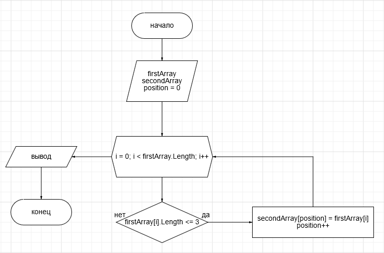

# Итоговая проверочная работа

## Блок схема алгоритма

## Описание решения

Пользователь задает массив с клавиатуры через запятую, далее, в методе **ShowShortArray**, циклом проходим по введенному массиву
и проверяем подходит ли элемент условию, если элемент удовлетворяет условие, тогда добавляем его в новый массив **secondArray**.
Затем методом **PrintArray** выводим полученный результат.

## Задача

Написать программу, которую из имеющегося массива строк 
формирует массив строк, длинна которых меньше либо равна 3 символам.
Первоначальный массив можно ввести с клавиатуры, либо задать на старте
выполнения алгоритма.
